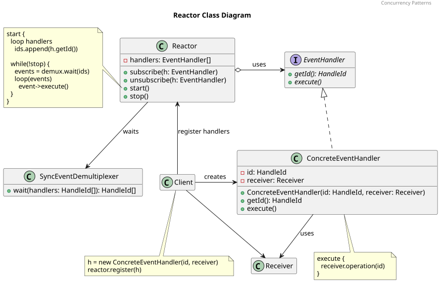
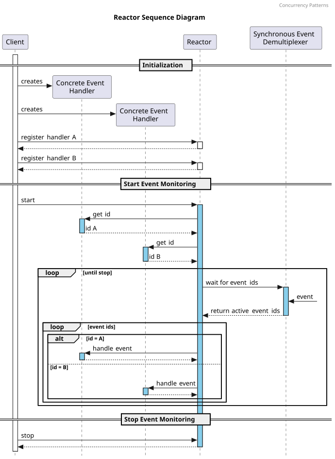

# REACTOR

## Pattern Name and Classification

Reactor. An Event Handling Pattern for Concurrent Programming

## Intent

The Reactor pattern is designed to efficiently handle multiple service requests concurrently delivered to a single-threaded service handler by demultiplexing and dispatching events to the appropriate event handlers.

The Reactor pattern is designed to efficiently handle many I/O events (like socket reads/writes) without creating a separate thread per connection.

## Also Known As

* Dispatcher
* Notifier

## Motivation (Forces)

This design pattern is analogous to a head chef in a busy kitchen, demonstrating its ability to manage high-scalability demands and maintain efficient task distribution in multithreaded environments. Instead of each chef handling one order at a time, there is a head chef who acts as the dispatcher. The head chef receives all the orders and decides which chef will handle which part of each order, ensuring that all chefs are utilized efficiently. This way, the kitchen can handle many orders simultaneously, ensuring that dishes are prepared quickly and efficiently without any one chef becoming a bottleneck. This setup is analogous to the Reactor pattern, where the head chef dispatches tasks (events) to various chefs (event handlers) to process multiple tasks concurrently.

## Applicability

Use the **Reactor** pattern when your system needs to:

* Handle many simultaneous events or clients efficiently using a single thread.
* React to input/output activity (instead of continuously polling or blocking).
* Separate event handling logic from event detection
* Run mostly I/O-bound tasks, where actual processing is quick but I/O waiting is frequent.

Use the **Reactor** pattern whenever your system needs to efficiently react to multiple concurrent, asynchronous I/O events, while keeping the core loop single-threaded and handler-driven.

## Structure

### Participants

The reactor concurrent pattern is based on the command (encapsulate requests) and observer (notifying event handlers) design patterns:

* **Client**

    The client creates concrete event handlers and register them into the reactor. After that, it signals the reactor to start monitoring the registered events.

* **Reactor**

    The reactor wait for events. It supports an interface to register and deregister the concrete event handler, then maps the events to their concrete event handler.

    The reactor manages the lifetime of the event loop.

* **Event handler**

    The event handler defines the interface for processing the events.

    The event handler defines the supported services of the application.

* **Concrete event handler**

    The concrete event handler implements the interface of the application defined by the event handler.

* **Receiver**

    Contains some business logic. Almost any object may act as a receiver. Most commands only handle the details of how a request is passed to the receiver, while the receiver itself does the actual work.

* **Synchronous event demultiplexer**

    The synchronous event demultiplexer waits for one or more indication events and blocks until the associated handle can process the event.

    The system calls select, poll, epoll, kqueue, or WaitForMultipleObjects enable it to wait for indication events.

### Collaboration

1. The **Client** creates concrete event handler to address different events and register them in the **Reactor**
2. Then the **Reactor** gets the id of all the registerd events and start monitoring them using a **Syncronous Event Demultiplexer** (`select()` or `poll()` on C++ applications).
3. The **Syncronous Event Demultiplexer** blocks the thread until one or more events are available, then returns the ids of the available events.
4. The **Reactor** execute the concrete event handler associated to each id.
5. After executing all **Concrete Event Handler** associated to the available events ids, the **Reactor** will start the monitoring again.

## Consequences

### Pros

- The Reactor pattern lets a single thread handle many concurrent connections. It avoids creating one thread per client, which saves context-switching overhead, memory, and CPU time.
- Reduced Threading Complexity. It’s often single-threaded or uses a small fixed pool
- The Reactor decouples event demultiplexing (detecting ready events — e.g., “socket X is readable”), from event handling (processing logic — e.g., “parse the message and respond”).
- Adding new event types or new handlers (e.g., to handle a new command or message type) is straightforward. You just register a new handler with the Reactor — no need to redesign the core event loop.
- The Reactor ensures the system remains responsive because no handler blocks the main event loop. While one handler processes an event, the Reactor can still monitor other sources for new activity.
- Handlers are independent modules that implement a simple interface (e.g., handle_read(), handle_write()). You can reuse or replace them easily across projects or contexts.
- Less thread creation and context switching means lower memory footprint and better CPU utilization. This makes it particularly well-suited for embedded systems or IoT gateways with limited resources.

### Cons

- All I/O is **non-blocking** and event-driven, the logic often gets **split across callbacks**. This can lead to **“callback hell”** or hard-to-follow control flow
- All event demultiplexing and dispatching happen in one thread. If a handler performs a **long or blocking operation**, it **blocks the entire loop**, causing latency or dropped events.
  - To mitigate this, systems often combine Reactor with a **thread pool** for heavy tasks — but that adds design complexity.
- A single Reactor loop runs on **one core**, so scaling across multiple cores requires creating **multiple Reactors** or **partitioned event loops**.
- On systems or platforms that **don’t support async I/O natively**(`select()`, `poll()`, `epoll()`, `kqueue()`, etc.), implementing Reactor properly can be cumbersome or inefficient.
- Since events are processed asynchronously, **exceptions and errors** must be handled carefully to avoid breaking the main loop.
- The pattern is optimized for **I/O-bound systems** (lots of waiting on sockets, few heavy computations). If the system mostly does **intensive data processing**, the single-threaded nature becomes inefficient — a **thread pool or actor model** would be more suitable.
- Because operations are non-blocking and split over multiple events, you often need to **manually track connection or request state** (e.g., “received header but not body yet”).

## Implementation

1. Identify Core Roles

* **Reactor** – runs the event loop, waits for events, and dispatches them.
* **Event Demultiplexer** – OS facility that reports which handles are ready (e.g., select/poll/epoll).
* **Handles** – sources of events (sockets, timers, files).
* **Event Handlers** – logic that runs when an event occurs (read/write/accept/error).
* **Receivers** - Will receive the details of how a request is passed and then will do the real work.

---

1. First, we define the Reactor interface to **register / modify / deregister** handles and their handlers.
2. Then, choose the event demultiplexer (e.g., select/poll/epoll) and design the event loop. Make sure all I/O is **non-blocking**.
3. In the event loop, **wait** for events using the demultiplexer. Then, **for each ready handle** the loop has to determine the event typeand **dispatch** to the corresponding handler method. Process **timers** or scheduled tasks if needed. **Repeat** until shutdown.
4. Each handler implements callbacksand must **not block**; offload heavy or blocking tasks to a **worker thread pool**. The handler also should maintain **state** for multi-step operations if needed.

## Known Uses

**Use the Reactor pattern when you need to handle many simultaneous I/O sources efficiently.**

It’s ideal for servers or systems managing numerous network connections, files, or sensors concurrently, without creating a thread per connection. The Reactor’s event-driven loop ensures scalability and responsiveness with minimal resource consumption. **Avoid the Reactor pattern when your system is primarily CPU-bound**

**Use the Reactor pattern when you want to avoid blocking operations.**

The design keeps the main thread non-blocking, reacting only when events occur. This prevents idle waiting and maintains high responsiveness even under heavy load or unpredictable input timing.

**Use the Reactor pattern when you need concurrency without multithreading complexity.**

It allows a single thread to manage multiple tasks concurrently through asynchronous event handling, eliminating race conditions, locks, and synchronization problems common in multi-threaded systems.

**Use the Reactor pattern when you want a clean separation between event detection and handling.**

It decouples the mechanism that detects events from the logic that processes them, leading to modular, maintainable, and easily extendable system architectures.

**Use the Reactor pattern when your system is primarily I/O-bound.**

If most processing time is spent waiting for input or output readiness, the Reactor ensures resources are used efficiently and latency is minimized through readiness-driven callbacks.

**Use the Reactor pattern when your platform supports non-blocking I/O.**

It’s especially suitable for environments providing APIs like `select()`, `poll()`, or `epoll()`, which efficiently report when I/O resources are ready for processing.

**Use the Reactor pattern when you need predictable, low resource usage.**

By relying on a single event loop instead of many threads, it provides consistent performance, stable memory use, and efficient CPU utilization—ideal for embedded or real-time systems.

**Use the Reactor pattern when you want to integrate timers or asynchronous tasks with I/O events.**

It allows unified handling of network activity, timeouts, and scheduled tasks in a single, consistent event-driven framework.

## Related Patterns

* `Reactor` uses the `Observer` pattern for handling events where event handlers are notified of changes.
* `Proactor` pattern is similar to `Reactor` but handles asynchronous I/O completion rather than readiness.
* To encapsulates a request as an object, allowing parameterization and queuing of requests the `Command` pattern is used.
* Use `Thread Pool`, `Half-Sync-Half-Async` or `Active Object` to avoid blocking the Reactor.
* Use `Acceptor` or `Connector` to organize connection lifecycle and protocols.
* Consider `Proactor`, `Actor` or `Reactive Streams` when you need completion-driven IO, greater isolation, or pipeline staging.

## References

[Dr. Douglas C. Schmidt Documents](https://www.dre.vanderbilt.edu/~schmidt/PDF/)

[Reactor - MC++ BLOG](https://www.modernescpp.com/index.php/reactor/)

[Reactor Pattern in Java: Mastering Non-blocking Event-Driven Architectures](https://java-design-patterns.com/patterns/reactor/)

[Reactor. An Object Behavioral Pattern for Demultiplexing and Dispatching Handles for Synchronous Events (Douglas C. Schmidt)](https://www.dre.vanderbilt.edu/~schmidt/PDF/Reactor.pdf)

[Patterns in C - Part 5: REACTOR - Adam Tornhill](http://www.adamtornhill.com/Patterns%20in%20C%205,%20REACTOR.pdf)
